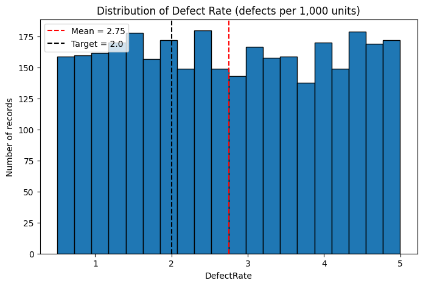

# Manufacturing Quality Improvement Through Defect Analysis - DMAIC Project

**Lean Six Sigma Green Belt**

## Overview
A self-initiated Six Sigma (DMAIC) project analyzing a manufacturing production dataset to identify drivers of product defects and recommend data-driven quality improvements.

## Problem Statement
Production data showed 84.04% of records classified as high-defect status, with an average defect rate of 2.75 defects per 1,000 units (range: 0.50–4.99) indicating a significant, recurring quality issue.

## Goal
Reduce high-defect-status incidence from 84.04% to 60%, and average defect rate from 2.75 to 2.0 per 1,000 units, by identifying key operational drivers using a data-driven DMAIC approach.

## Methodology (DMAIC)
- **Define**: Problem/goal statement, business case, CTQ tree, SIPOC
- **Measure**: Baseline analysis (3,240 records), distribution analysis, process capability (sigma level)
- **Analyze**: Correlation analysis, multiple linear regression, logistic regression to identify statistically significant defect drivers
- **Improve**: Targeted recommendations prioritized by impact vs. effort
- **Control**: Monitoring plan (SPC charts, review cadence) to sustain gains

## Key Findings
- No individual or combined operational factor showed a significant relationship with **defect rate** (R² = 0.0014)
- **MaintenanceHours** and **QualityScore** showed statistically significant relationships with **defect status classification** (Pseudo R² = 0.156, p<0.001)
- MaintenanceHours' positive relationship likely reflects reverse causation (higher-risk lines receive more maintenance attention)

## Recommendations
1. Strengthen in-process quality checks to improve QualityScore
2. Shift from reactive to preventive/scheduled maintenance
3. Introduce SPC monitoring on defect rate
4. Expand future data collection (defect type, machine ID, shift) for deeper root-cause analysis

## Tools Used
Python (pandas, matplotlib, scikit-learn, statsmodels), Excel, PowerPoint

## Dataset
[Predicting Manufacturing Defects Dataset](https://www.kaggle.com/datasets/rabieelkharoua/predicting-manufacturing-defects-dataset) by Rabie El Kharoua (Kaggle, CC BY 4.0, synthetic data)

## Repository Contents
- `DMAIC_Phases.pptx`: Full DMAIC project deck (Define through Control)
- `manufacturing_defect_analysis.ipynb`: Python analysis (Measure, Analyze)
- Charts and visualizations generated during analysis
  

## Scope Note
This is a self-initiated project using a static, synthetic dataset for skills demonstration. Analysis concludes at the recommendation and control-planning stage; actual impact would require live implementation and monitoring in a real production environment.
